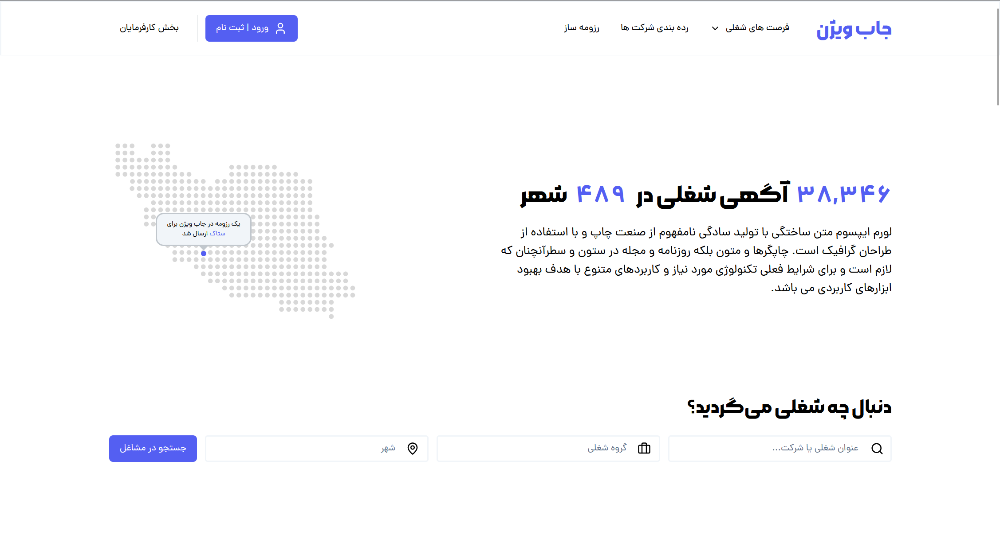
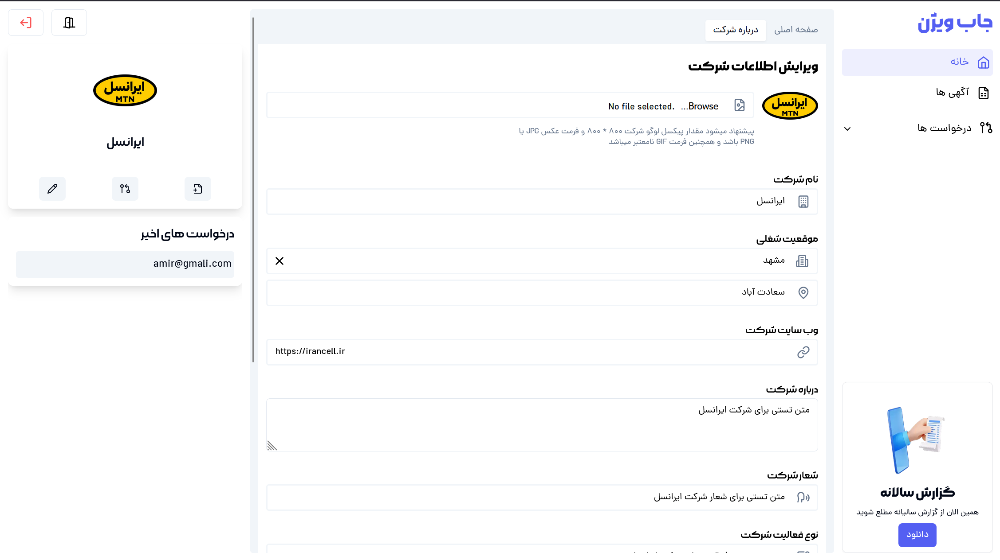
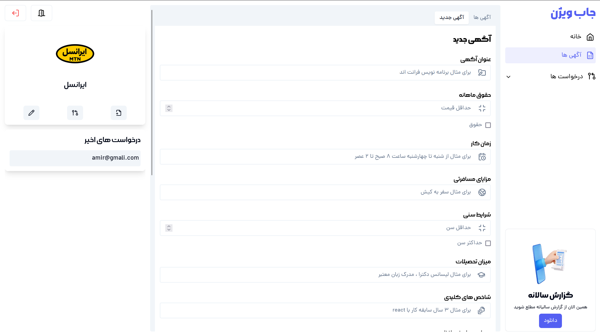
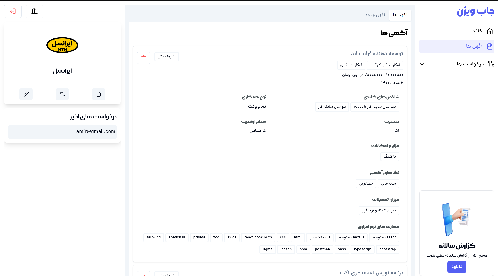
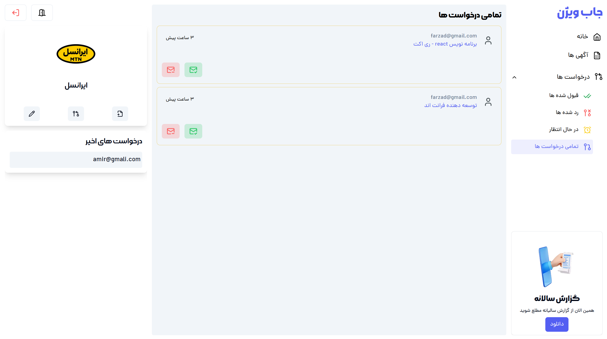

# JobVision Clone

The Full-stack project using `Next-js Typescript`

## Table of Contents

1. [Description](#description)
2. [Usage](#usage)
3. [Features](#features)
4. [Technology](#technology)
5. [Contributing](#contributing)

## Description

This project aims to replicate the functionality and design of the jobvision.ir website. It provides a platform for job

## Usage

The project deploy using liara and url of bellow

click to see [jobvision clone](https://jobvision-clone.liara.run)

1. First you need to sign
2. Click on the notification at the bottom right of the page to enter your panel `مشاهده پنل`
3. On the right side of the screen, you can see the menu of dashboard pages (or you can enter the important pages of your panel with the quick access keys on the left side)
4. To add or edit your company, enter "About Company" at the top of the page from the "Home" menu and click on the "Register Company" button after filling in the fields.
5. After adding Khurd company, you can create your desired ads
6. To add your advertising, enter `آگهی جدید` at the top of the page from the `آگهی ها` menu and click on the `ثبت آگهی` button after filling in the fields
7. You can view or delete your ads on the `آگهی ها` page
8. At the bottom left, you can see the list of people who follow your company name `دنبال کنندگان`
9. On the requests page, you can see people who send requests for your ad

- Dashboard company form

- Dashboard dvertisign form

- Dashboard dvertisign list

- Dashboard CV Request

## Features

- Add your comapny
- Add your company advertising and manage it(just delete)
- Send your CV for the company you want exept your company ;)
- Search between the advertising's
- Follow another componies

## Technology

- Next-Js
- Typescript 
- Prisma
- Radix-Ui
- Supabase
- Loadash
- Bcrypt
- JsonWebToken
- Lucide-react
- Swiper
- SWR
- Tailwind
- Zod
- Zustand
- React-spinners
- React-multi-date-picker

## Contributing

We welcome contributions! Feel free to submit a pull request or open an issue.
